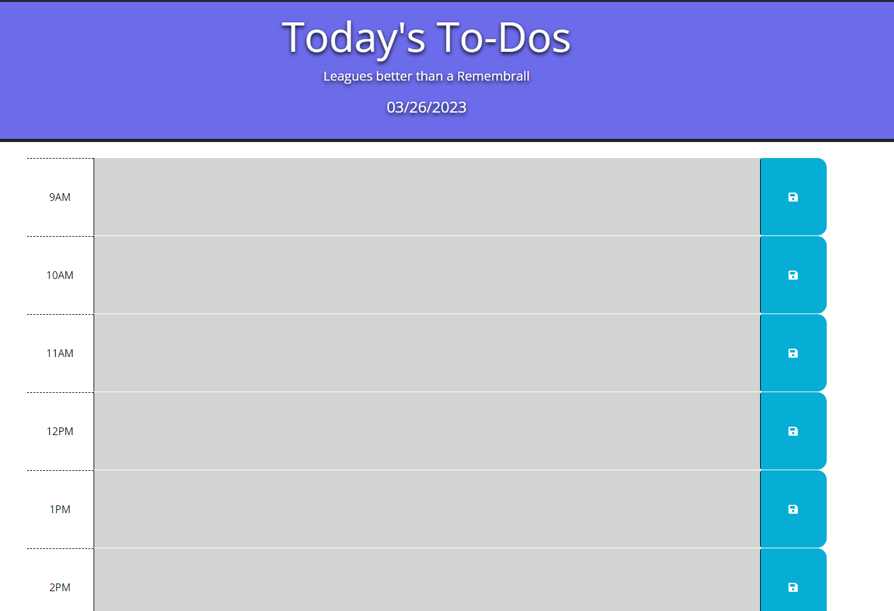

# Today's To-Dos
[Link to the Web App](https://ds055.github.io/daily-scheduler/)

## Description
This planner allows users to enter work tasks for given hours and save said activities locally on their device.

## Screenshot

## Installation
N/A

## Usage
* Users will arrive at the website--perhaps discovered via a search engine.
* Choosing a given time slot, users can type scheduled tasks into the text box. 
* Tasks can be saved by clicking the button sporting the floppy disk icon on the end of the row.
* The data will then be saved locally to the users system, ensuring its continuance after page reload.

## License
Please refer to the license in the repo.

- - -